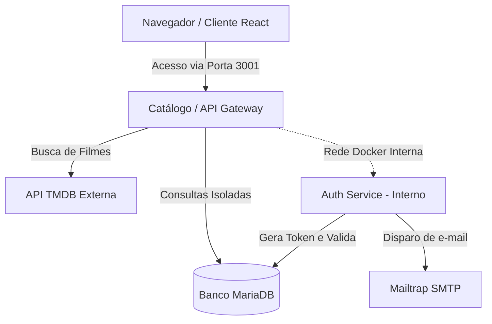
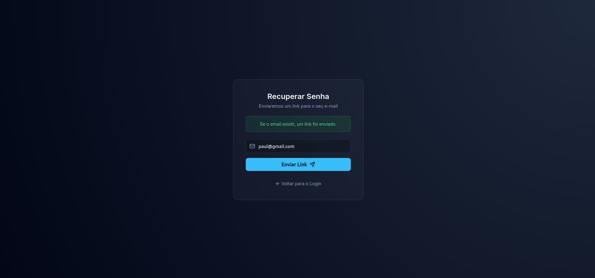
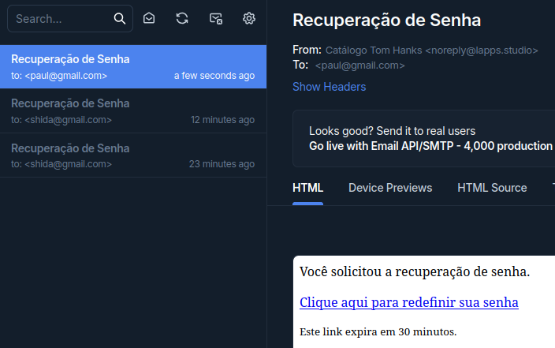
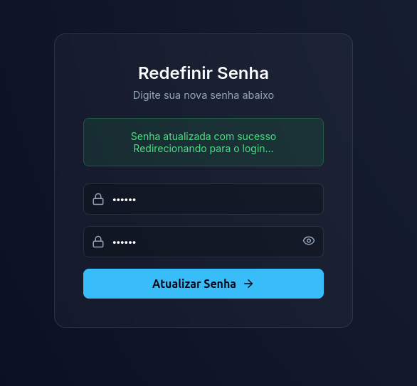
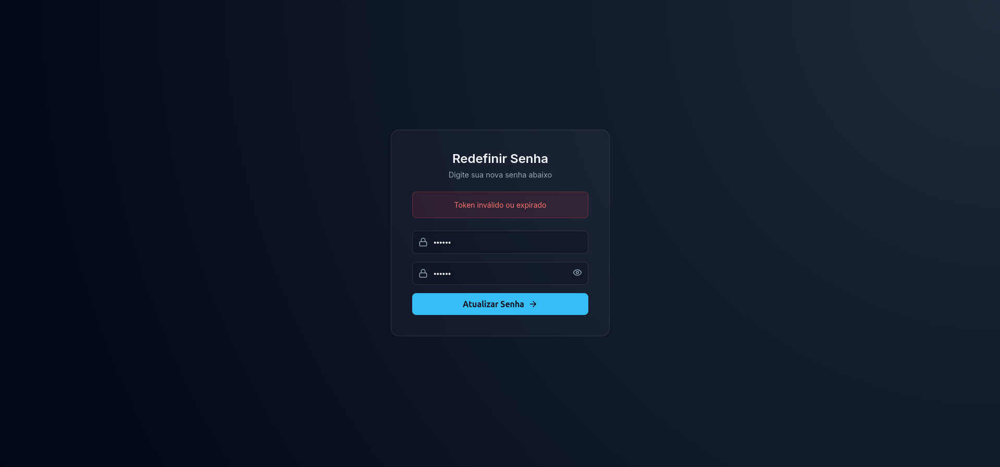

# 🎬 Catálogo de Filmes — Tom Hanks

Aplicação web completa construída para navegar pelos filmes do Tom Hanks, integrada ao **TMDB API** em tempo real. Cada usuário possui seu próprio espaço isolado no banco de dados para salvar seus filmes favoritos e registrar comentários, sem acesso aos dados de outros usuários.

Desenvolvido para a disciplina de Arquiteturas Cloud , lecionada pelo professor **[@siriani](https://github.com/siriani)**.

---

## 🚀 Funcionalidades Principais

- **Autenticação com JWT (Desacoplada):** Cadastro, Login seguro com senhas criptografadas (Bcrypt) e Recuperação de Senha via E-mail (Mailtrap), rodando em um microsserviço independente.
- **Catálogo em Tempo Real:** Listagem dinâmica da filmografia do Tom Hanks consumida da API externa do TMDB.
- **UX Premium (UI 2026):** Design *Glassmorphism* com tema cinematográfico, animações suaves, *Optimistic UI* (atualização instantânea ao favoritar) e *View Transitions API*.
- **Pesquisa Local:** Barra de pesquisa instantânea para filtrar filmes pelo título.
- **Isolamento de Dados (Multi-tenancy):** Favoritos e Comentários 100% segregados por usuário no MariaDB.

---

## 🏗️ Arquitetura do Sistema (Atividade 3)

O projeto evoluiu para uma arquitetura de Microsserviços. O Catálogo agora atua como porta de entrada pública, enquanto o **Serviço de Autenticação** opera apenas na rede interna do Docker, garantindo máxima segurança.



### 🛠️ Stack Tecnológica
| Camada | Tecnologia |
| ------ | ---------- |
| **Frontend** | React 19 + TypeScript + Vite + Lucide Icons |
| **Backend (Catálogo)**  | Node.js + Express + TypeScript |
| **Microservice (Auth)** | Node.js + Express + Nodemailer |
| **Banco**    | MariaDB / MySQL (Driver `mysql2`) |
| **Segurança**| JWT (JSON Web Tokens) + Bcrypt |
| **Deploy**   | Docker Compose (Multi-container) |

---

## 📸 Demonstração: Fluxo de Recuperação de Senha


| Pedido de Recuperação | E-mail Recebido no Mailtrap |
| :---: | :---: |
|  |  |

| Redefinição de Senha | Segurança (Token Expirado/Usado) |
| :---: | :---: |
|  |  |

---

## 🔒 Segurança e Tratamento de Variáveis

O professor instruiu explicitamente: **Nenhuma credencial deve ser exposta no código ou no navegador**.
Por conta disso:
1. **O frontend nunca faz chamadas diretas ao TMDB ou ao MariaDB.**
2. Todas as chaves secretas residem apenas nas **Variáveis de Ambiente** do servidor.
3. O `.env` está protegido no `.gitignore`.

### ⚙️ Arquivo `.env.example`
O `docker-compose.yml` exige as seguintes variáveis na raiz do projeto:
```env
PORT=3001
DB_HOST=35.226.64.52
DB_PORT=3306
DB_USER=seu_usuario
DB_PASSWORD="sua_senha_com_aspas"
DB_NAME=seu_banco
TMDB_API_KEY=sua_chave_tmdb
JWT_SECRET=super_segredo_jwt

# Mailtrap Config (Para testar o Esqueci a Senha)
MAILTRAP_HOST=sandbox.smtp.mailtrap.io
MAILTRAP_PORT=2525
MAILTRAP_USER=seu_usuario_mailtrap
MAILTRAP_PASS=sua_senha_mailtrap
```

---

## 🗄️ Esquema do Banco de Dados

As queries backend filtram rigidamente por `usuario_id = ?`, impedindo vazamento de dados. A tabela `reset_tokens` e a coluna `role` foram adicionadas para gerenciar a recuperação de senha e autorização.

```sql
CREATE TABLE usuarios (
  id INT AUTO_INCREMENT PRIMARY KEY,
  nome VARCHAR(100) NOT NULL,
  email VARCHAR(150) UNIQUE NOT NULL,
  senha_hash VARCHAR(255) NOT NULL,
  role VARCHAR(20) DEFAULT 'usuario',
  criado_em TIMESTAMP DEFAULT CURRENT_TIMESTAMP
);

CREATE TABLE reset_tokens (
  token VARCHAR(100) PRIMARY KEY,
  usuario_id INT NOT NULL,
  criado_em TIMESTAMP DEFAULT CURRENT_TIMESTAMP,
  expira_em TIMESTAMP NOT NULL,
  usado BOOLEAN DEFAULT FALSE,
  FOREIGN KEY (usuario_id) REFERENCES usuarios(id)
);

CREATE TABLE favoritos (
  id INT AUTO_INCREMENT PRIMARY KEY,
  usuario_id INT NOT NULL,
  tmdb_movie_id INT NOT NULL,
  titulo VARCHAR(255) NOT NULL,
  poster_path VARCHAR(255),
  criado_em TIMESTAMP DEFAULT CURRENT_TIMESTAMP,
  FOREIGN KEY (usuario_id) REFERENCES usuarios(id),
  UNIQUE (usuario_id, tmdb_movie_id)
);

CREATE TABLE comentarios (
  id INT AUTO_INCREMENT PRIMARY KEY,
  usuario_id INT NOT NULL,
  tmdb_movie_id INT NOT NULL,
  texto TEXT NOT NULL,
  criado_em TIMESTAMP DEFAULT CURRENT_TIMESTAMP,
  FOREIGN KEY (usuario_id) REFERENCES usuarios(id)
);
```

### Testando Localmente
A forma mais fácil de rodar o projeto agora é subindo a infraestrutura completa do Docker Compose, que orquestra automaticamente a rede interna do Microsserviço e expõe o Catálogo:

```bash
docker-compose up -d --build
```
Após o build, abra `http://localhost:3001` no seu navegador.
