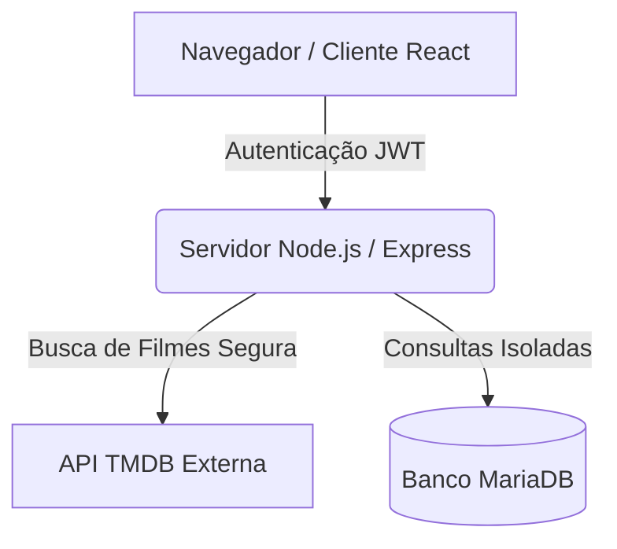

# 🎬 Catálogo de Filmes — Tom Hanks

Aplicação web completa construída para navegar pelos filmes do Tom Hanks, integrada ao **TMDB API** em tempo real. Cada usuário possui seu próprio espaço isolado no banco de dados para salvar seus filmes favoritos e registrar comentários, sem acesso aos dados de outros usuários.

Desenvolvido para a disciplina de Arquiteturas Cloud p/ Big Data e Projeto Integrador, lecionada pelo professor **@siriani**.

---

## 🚀 Funcionalidades Principais

- **Autenticação com JWT:** Cadastro e Login seguros com senhas criptografadas (Bcrypt).
- **Catálogo em Tempo Real:** Listagem dinâmica da filmografia do Tom Hanks consumida da API externa do TMDB.
- **UX Premium (UI 2026):** Design *Glassmorphism* com tema cinematográfico, animações suaves, *Optimistic UI* (atualização instantânea ao favoritar) e *View Transitions API*.
- **Pesquisa Local:** Barra de pesquisa instantânea para filtrar filmes pelo título.
- **Isolamento de Dados (Multi-tenancy):** Favoritos e Comentários 100% segregados por usuário no MariaDB.

---

## 🏗️ Arquitetura do Sistema

O projeto é dividido em um Frontend reativo (React) e um Backend (Node.js/TypeScript) que gerencia as regras de negócio e protege as credenciais.



### 🛠️ Stack Tecnológica
| Camada | Tecnologia |
| ------ | ---------- |
| **Frontend** | React 19 + TypeScript + Vite + Lucide Icons |
| **Backend**  | Node.js + Express + TypeScript |
| **Banco**    | MariaDB / MySQL (Driver `mysql2`) |
| **Segurança**| JWT (JSON Web Tokens) + Bcrypt |
| **Deploy**   | Docker (Multi-stage Build) |

---

## 🔒 Segurança e Tratamento de Variáveis

O professor instruiu explicitamente: **Nenhuma credencial deve ser exposta no código ou no navegador**.
Por conta disso:
1. **O frontend nunca faz chamadas diretas ao TMDB ou ao MariaDB.**
2. Todas as chaves secretas residem apenas nas **Variáveis de Ambiente** do servidor.
3. O `.env` está protegido no `.gitignore`.

### ⚙️ Arquivo `.env.example`
O Portainer (ou o arquivo local) exige as seguintes variáveis:
```env
PORT=3001
DB_HOST=35.226.64.52
DB_PORT=3306
DB_USER=seu_usuario
DB_PASSWORD="sua_senha_com_aspas"
DB_NAME=seu_banco
TMDB_API_KEY=sua_chave_tmdb
JWT_SECRET=super_segredo_jwt
```

---

## 🗄️ Esquema do Banco de Dados

As queries backend filtram rigidamente por `usuario_id = ?`, impedindo vazamento de dados.

```sql
CREATE TABLE usuarios (
  id INT AUTO_INCREMENT PRIMARY KEY,
  nome VARCHAR(100) NOT NULL,
  email VARCHAR(150) UNIQUE NOT NULL,
  senha_hash VARCHAR(255) NOT NULL,
  criado_em TIMESTAMP DEFAULT CURRENT_TIMESTAMP
);

CREATE TABLE favoritos (
  id INT AUTO_INCREMENT PRIMARY KEY,
  usuario_id INT NOT NULL,
  tmdb_movie_id INT NOT NULL,
  titulo VARCHAR(255) NOT NULL,
  poster_path VARCHAR(255),
  criado_em TIMESTAMP DEFAULT CURRENT_TIMESTAMP,
  FOREIGN KEY (usuario_id) REFERENCES usuarios(id),
  UNIQUE (usuario_id, tmdb_movie_id)
);

CREATE TABLE comentarios (
  id INT AUTO_INCREMENT PRIMARY KEY,
  usuario_id INT NOT NULL,
  tmdb_movie_id INT NOT NULL,
  texto TEXT NOT NULL,
  criado_em TIMESTAMP DEFAULT CURRENT_TIMESTAMP,
  FOREIGN KEY (usuario_id) REFERENCES usuarios(id)
);
```

### Testando Localmente
Se preferir rodar no seu computador:
1. Acesse `backend/` -> Rode `npm install` e `npm run dev` (Obrigatório configurar o `.env`).
2. Acesse `frontend/` -> Rode `npm install` e `npm run dev`.
3. Abra `http://localhost:5173`.
