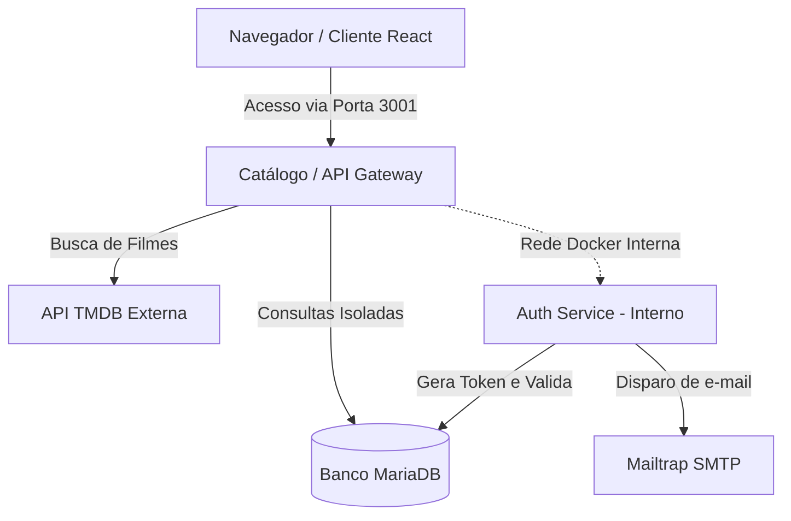
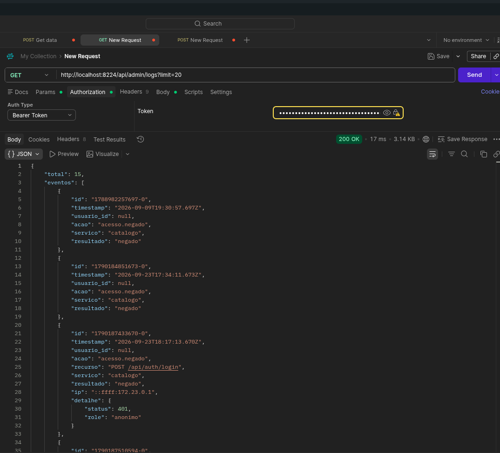
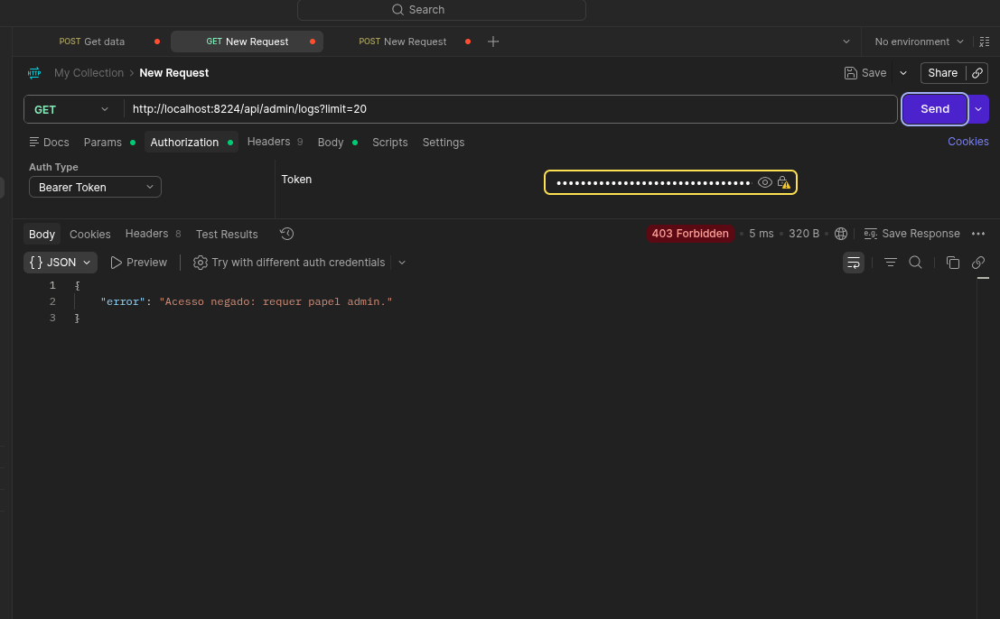
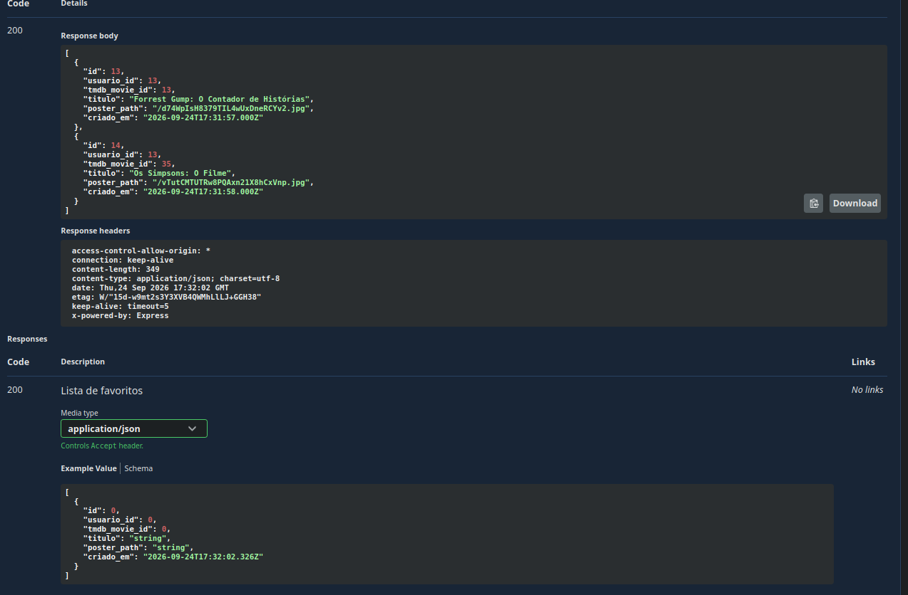

# 🎬 Catálogo de Filmes — Tom Hanks

Aplicação web completa construída para navegar pelos filmes do Tom Hanks, integrada ao **TMDB API** em tempo real. Cada usuário possui seu próprio espaço isolado no banco de dados para salvar seus filmes favoritos e registrar comentários, sem acesso aos dados de outros usuários.

Desenvolvido para a disciplina de Arquiteturas Cloud , lecionada pelo professor **[@siriani](https://github.com/siriani)**.

---

## 🚀 Funcionalidades Principais

- **Autenticação com JWT (Desacoplada):** Cadastro, Login seguro com senhas criptografadas (Bcrypt) e Recuperação de Senha via E-mail (Mailtrap), rodando em um microsserviço independente.
- **Catálogo em Tempo Real:** Listagem dinâmica da filmografia do Tom Hanks consumida da API externa do TMDB.
- **UX Premium (UI 2026):** Design *Glassmorphism* com tema cinematográfico, animações suaves, *Optimistic UI* (atualização instantânea ao favoritar) e *View Transitions API*.
- **Pesquisa Local:** Barra de pesquisa instantânea para filtrar filmes pelo título.
- **Isolamento de Dados (Multi-tenancy):** Favoritos e Comentários 100% segregados por usuário no MariaDB.

---

## 🏗️ Arquitetura do Sistema (Atividade 3)

O projeto evoluiu para uma arquitetura de Microsserviços. O Catálogo agora atua como porta de entrada pública, enquanto o **Serviço de Autenticação** opera apenas na rede interna do Docker, garantindo máxima segurança.



### 🛠️ Stack Tecnológica
| Camada | Tecnologia |
| ------ | ---------- |
| **Frontend** | React 19 + TypeScript + Vite + Lucide Icons |
| **Backend (Catálogo)**  | Node.js + Express + TypeScript |
| **Microservice (Auth)** | Node.js + Express + Nodemailer |
| **Banco**    | MariaDB / MySQL (Driver `mysql2`) |
| **Segurança**| JWT (JSON Web Tokens) + Bcrypt |
| **Deploy**   | Docker Compose (Multi-container) |

---

## 📸 Demonstração: Fluxo de Recuperação de Senha


| Pedido de Recuperação | E-mail Recebido no Mailtrap |
| :---: | :---: |
|  |  |

| Redefinição de Senha | Segurança (Token Expirado/Usado) |
| :---: | :---: |
|  |  |

---

## 🔒 Segurança e Tratamento de Variáveis

O professor instruiu explicitamente: **Nenhuma credencial deve ser exposta no código ou no navegador**.
Por conta disso:
1. **O frontend nunca faz chamadas diretas ao TMDB ou ao MariaDB.**
2. Todas as chaves secretas residem apenas nas **Variáveis de Ambiente** do servidor.
3. O `.env` está protegido no `.gitignore`.

### ⚙️ Arquivo `.env.example`
O `docker-compose.yml` exige as seguintes variáveis na raiz do projeto:
```env
PORT=3001
DB_HOST=ip_do_seu_banco
DB_PORT=3306
DB_USER=seu_usuario
DB_PASSWORD="sua_senha_com_aspas"
DB_NAME=seu_banco
TMDB_API_KEY=sua_chave_tmdb
JWT_SECRET=super_segredo_jwt

# Mailtrap Config (Para testar o Esqueci a Senha)
MAILTRAP_HOST=sandbox.smtp.mailtrap.io
MAILTRAP_PORT=2525
MAILTRAP_USER=seu_usuario_mailtrap
MAILTRAP_PASS=sua_senha_mailtrap
```

---

## 🗄️ Esquema do Banco de Dados

As queries backend filtram rigidamente por `usuario_id = ?`, impedindo vazamento de dados. A tabela `reset_tokens` e a coluna `role` foram adicionadas para gerenciar a recuperação de senha e autorização.

```sql
CREATE TABLE usuarios (
  id INT AUTO_INCREMENT PRIMARY KEY,
  nome VARCHAR(100) NOT NULL,
  email VARCHAR(150) UNIQUE NOT NULL,
  senha_hash VARCHAR(255) NOT NULL,
  role VARCHAR(20) DEFAULT 'usuario',
  criado_em TIMESTAMP DEFAULT CURRENT_TIMESTAMP
);

CREATE TABLE reset_tokens (
  token VARCHAR(100) PRIMARY KEY,
  usuario_id INT NOT NULL,
  criado_em TIMESTAMP DEFAULT CURRENT_TIMESTAMP,
  expira_em TIMESTAMP NOT NULL,
  usado BOOLEAN DEFAULT FALSE,
  FOREIGN KEY (usuario_id) REFERENCES usuarios(id)
);

CREATE TABLE favoritos (
  id INT AUTO_INCREMENT PRIMARY KEY,
  usuario_id INT NOT NULL,
  tmdb_movie_id INT NOT NULL,
  titulo VARCHAR(255) NOT NULL,
  poster_path VARCHAR(255),
  criado_em TIMESTAMP DEFAULT CURRENT_TIMESTAMP,
  FOREIGN KEY (usuario_id) REFERENCES usuarios(id),
  UNIQUE (usuario_id, tmdb_movie_id)
);

CREATE TABLE comentarios (
  id INT AUTO_INCREMENT PRIMARY KEY,
  usuario_id INT NOT NULL,
  tmdb_movie_id INT NOT NULL,
  texto TEXT NOT NULL,
  criado_em TIMESTAMP DEFAULT CURRENT_TIMESTAMP,
  FOREIGN KEY (usuario_id) REFERENCES usuarios(id)
);
```

---

## 🛡️ Controle de Acesso por Papel (RBAC) - Atividade 4

Para a Atividade 4, a aplicação evoluiu para garantir segurança real no lado do servidor, implementando RBAC.

### Permissões Documentadas (Requisito 1)
- **`usuario`**: O papel padrão. Pode navegar pelo catálogo, favoritar filmes, adicionar comentários aos filmes e excluir **apenas os próprios comentários**.
- **`admin`**: O papel de moderação. Pode fazer tudo o que o `usuario` faz, e tem a exclusividade de **apagar qualquer comentário de qualquer usuário**, atuando como moderador da plataforma.

### Padrão Arquitetural: A ou B? (Requisito 5)
A nossa aplicação utiliza o **Padrão B (claims no token JWT)**.

**Por quê?** 
Ao invés de fazer o catálogo consultar o `auth-service` a cada ação para saber as permissões do usuário (Padrão A), nós injetamos o `role` do usuário no momento da criação do token JWT.
O Catálogo consegue interceptar esse token no Middleware (`authMiddleware.ts`), validar a assinatura usando o mesmo `JWT_SECRET` e liberar (ou negar com `403`) a rota localmente, baseando-se no `role` presente nas *claims* do token. Isso economiza chamadas de rede e deixa o sistema mais rápido, com o *trade-off* de que a mudança de papel de um usuário só entra em vigor quando o token expirar e for renovado.

Se mudássemos para o **Padrão A**, o catálogo (backend) precisaria, em cada endpoint restrito, fazer uma chamada HTTP (via `fetch` ou `axios`) para uma rota do `auth-service` perguntando se aquele usuário tem a permissão, o que acoplaria ainda mais os serviços.

### Testando Localmente
A forma mais fácil de rodar o projeto agora é subindo a infraestrutura completa do Docker Compose, que orquestra automaticamente a rede interna do Microsserviço e expõe o Catálogo:

```bash
docker compose up -d --build
```
Após o build, abra `http://localhost:3001` no seu navegador.

---

## 📋 Auditoria e Logs (Atividade 5)

Foi criado um microsserviço independente (`log-service`) dedicado exclusivamente à auditoria e observabilidade das ações da plataforma, utilizando **Redis Streams**.

### 🐳 Topologia Docker
A orquestração do sistema garante que a rede interna proteja os serviços. Apenas o catálogo expõe porta ao mundo exterior.
```yaml
  log-service:
    build:
      context: ./log-service
      dockerfile: Dockerfile
    container_name: log_tom_hanks
    networks:
      - tom_hanks_net
    environment:
      - LOG_PORT=3002
      - REDIS_URL=redis://:${REDIS_PASSWORD}@redis:6379
      - AUDIT_STREAM_MAXLEN=${AUDIT_STREAM_MAXLEN}
      - INTERNAL_SERVICE_TOKEN=${INTERNAL_SERVICE_TOKEN}
    depends_on:
      redis:
        condition: service_healthy

  redis:
    image: redis:7-alpine
    container_name: redis_tom_hanks
    command: redis-server --appendonly yes --requirepass ${REDIS_PASSWORD}
    networks:
      - tom_hanks_net
    volumes:
      - redis_data:/data
```

### 📸 Evidências

**Print 1: Consulta de logs como Admin**


**Print 2: Consulta barrada (403) para usuário comum, devidamente auditada**


### 🏗️ Decisões Arquiteturais

- **Justificativa do Redis Streams (ADR-002):** Log de auditoria tem um padrão de uso muito distinto de dado de negócio: escreve muito, lê pouco, e não requer transações complexas. O MariaDB não é a ferramenta certa. Redis Streams resolve o problema perfeitamente oferecendo ordem cronológica absoluta, geração de timestamp nativa (`XADD`) e controle fácil de limite de memória com o parâmetro `MAXLEN`.
- **Emissão Fire-and-Forget (ADR-004):** A comunicação com o serviço de log é feita de forma assíncrona (sem aguardar o término da requisição com `await`). Motivo: **a auditoria não pode derrubar o negócio**. Se o `log-service` ficar indisponível, falhamos a emissão silenciosamente, garantindo que o usuário consiga continuar usando o catálogo sem perceber a queda do micro-serviço.
- **Evitando Eventos Duplicados:** O middleware de auditoria de acessos negados (`auditDenials`) existe *apenas* no Catálogo (Gateway). Como todo o tráfego do `auth-service` passa obrigatoriamente por ele, colocar o interceptor nos dois locais geraria logs duplicados na trilha.
- **Ressalva do IP (RF-10):** Você notará que eventos do `auth-service` (ex: login) registram o IP do container do catálogo (ex: `172...`), enquanto eventos diretos no catálogo registram o IP do host da máquina/usuário. Isso é esperado, visto que o Catálogo atua como *proxy reverso* transparente e, propositalmente, não ativamos repasses de `trust proxy` para fins educacionais nesta etapa.

---

## 📖 Documentação da API com Swagger/OpenAPI (Atividade Extra)

Para garantir que o contrato da API seja visível e testável sem precisar ler nenhuma linha de código, a documentação interativa foi implementada usando **Swagger UI** e a especificação padrão **OpenAPI**.

Foram documentados 2 microsserviços da arquitetura:
1. **Catálogo (Backend):** O arquivo de especificação está localizado em `backend/src/docs/openapi.yaml`.
2. **Auth Service:** O arquivo de especificação está localizado em `auth-service/src/docs/openapi.yaml`.

### 🛠️ Ferramentas Utilizadas
- `swagger-ui-express`: Usado para ler o arquivo da especificação e renderizar a página interativa do Swagger diretamente na aplicação Express.
- `yamljs`: Usado para fazer o parser do arquivo YAML nativo para objetos do JavaScript.

### 📸 Evidência: Chamada Real pelo Navegador ("Try it out")
Abaixo está a demonstração da interface do Swagger UI rodando localmente, mostrando a expansão de um endpoint e a execução real de uma requisição contra a API:



### 🚀 Como Acessar a Documentação
Com os containers rodando via Docker Compose, você pode acessar a interface interativa da documentação chamando a rota `/apidocs`. 

Considerando a porta mapeada na rede do Catálogo, basta abrir no navegador:
```bash
http://localhost:8224/apidocs
```
